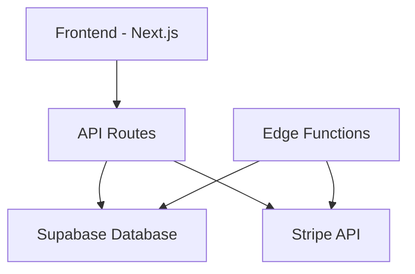

# PayKit System Architecture

## System Overview



## Core Technologies

### Frontend
- **Next.js App Router**: Server-side rendering and API routes
- **React**: Component-based UI
- **TypeScript**: Type safety and developer experience
- **TailwindCSS + Radix UI**: Styling and components

### Backend
- **Supabase**: Database, authentication, and edge functions
- **Stripe**: Payment processing and Connect platform
- **Edge Functions**: Background processing and webhooks

### Key Design Patterns

1. **Pending-to-Active Pattern**
   - Create pending records first
   - Validate and process
   - Migrate to active records
   - Clean up pending records

2. **Context-based State Management**
   - Each major feature has its own context
   - Contexts handle API calls and state updates
   - Components consume context through hooks

3. **Wizard Pattern**
   - Multi-step forms with validation
   - State persistence between steps
   - Side panel for real-time preview

4. **Money Handling**
   - Custom Money class for calculations
   - All DB storage in cents
   - Display formatting in dollars

## Database Structure

### Core Tables
- customers
- payment_plans
- transactions
- stripe_accounts
- activity_logs

### Pending Tables
- pending_customers
- pending_payment_plans
- pending_transactions

### Enums
- payment_interval_type: ['weekly', 'monthly']
- transaction_type: ['downpayment', 'installment']
- payment_status_type: ['pending', 'active', 'completed', 'failed']

## Common Patterns

### API Route Pattern
```typescript
export async function POST(req: Request) {
  try {
    // 1. Get supabase client
    const supabase = createClient()
    
    // 2. Verify authentication
    const session = await getSession()
    
    // 3. Parse and validate input
    const data = await req.json()
    
    // 4. Start database transaction
    const { data: result, error } = await supabase
      .rpc('database_function', data)
    
    // 5. Handle errors
    if (error) throw error
    
    // 6. Return response
    return NextResponse.json(result)
  } catch (error) {
    // 7. Error handling
    return handleApiError(error)
  }
}
```

### Database Function Pattern
```sql
CREATE OR REPLACE FUNCTION function_name(
    p_user_id UUID,
    -- other parameters
)
RETURNS type
LANGUAGE plpgsql
SECURITY DEFINER
AS $$
DECLARE
    v_variable type;
BEGIN
    -- 1. Input validation
    
    -- 2. Main logic
    
    -- 3. Error handling
    
    -- 4. Return result
EXCEPTION
    WHEN OTHERS THEN
        -- Handle errors
END;
$$;
```

### Frontend Component Pattern
```typescript
export default function ComponentName() {
  // 1. Context and state
  const context = useContext()
  const [state, setState] = useState()
  
  // 2. Effects and callbacks
  useEffect(() => {
    // Setup, data fetching, cleanup
  }, [])
  
  // 3. Event handlers
  const handleEvent = async () => {
    try {
      // Handle event
    } catch (error) {
      // Handle error
    }
  }
  
  // 4. Render
  return (
    <ComponentLayout>
      <ChildComponents />
    </ComponentLayout>
  )
}
```

## Important Conventions

### File Structure
```
app/
  ├── api/            # API routes
  ├── (auth)/         # Auth-related routes
  ├── dashboard/      # Dashboard pages
  ├── settings/       # Settings pages
  └── utils/          # Shared utilities
components/
  ├── ui/            # Shared UI components
  └── features/      # Feature-specific components
types/               # TypeScript types
supabase/
  ├── functions/     # Edge functions
  └── migrations/    # Database migrations
```

### Naming Conventions
- **Components**: PascalCase (e.g., `PaymentPlanForm.tsx`)
- **Files**: kebab-case (e.g., `payment-utils.ts`)
- **Database Functions**: snake_case (e.g., `create_payment_plan`)
- **API Routes**: kebab-case (e.g., `/api/create-payment-plan`)

### Type Conventions
- Prefix interfaces with 'I' (e.g., `IPaymentPlan`)
- Use 'Type' suffix for types (e.g., `PaymentStatusType`)
- Use enums for fixed sets of values

### Error Handling
1. Database functions throw errors with RAISE
2. API routes catch and format errors
3. Frontend shows errors in toast notifications
4. All errors are logged for debugging

### Security Practices
1. All database functions use SECURITY DEFINER
2. API routes verify authentication
3. RLS policies control data access
4. Environment variables for sensitive data

## Common Tasks

### Adding a New Feature
1. Create database migration
2. Add RLS policies
3. Create API routes
4. Add frontend components
5. Update types

### Debugging Process
1. Check frontend console logs
2. Verify API route responses
3. Check database function logs
4. Validate data consistency

### Testing
1. Test database functions
2. Test API routes
3. Test frontend components
4. End-to-end testing
